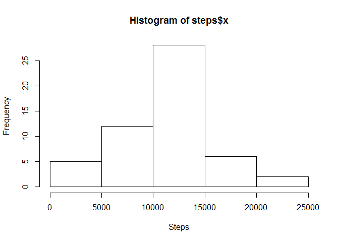
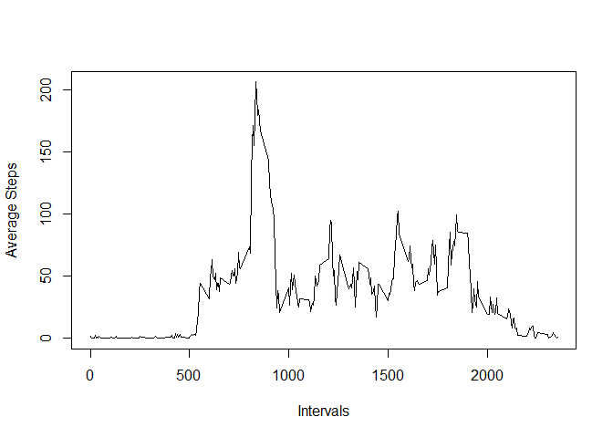
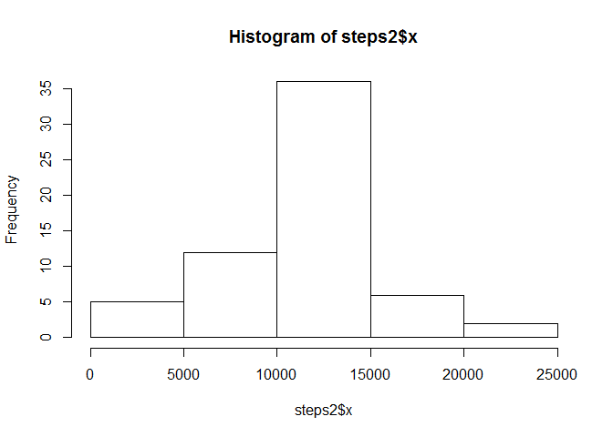
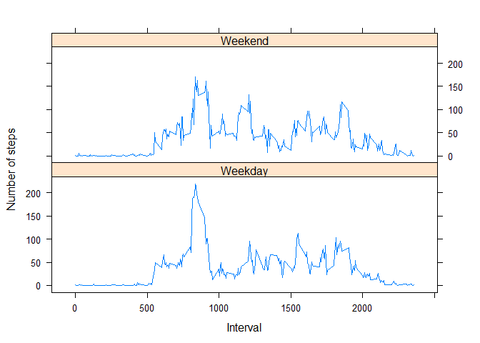

# Reproducible Research: Peer Assessment 1

## Loading and preprocessing the data

```r
download.file("http://d396qusza40orc.cloudfront.net/repdata%2Fdata%2Factivity.zip","tempzip.zip")
data <- read.table(unz("tempzip.zip", "activity.csv"), sep = ",", header = TRUE, na.string = "NA")
head(data)
```

```
##   steps       date interval
## 1    NA 2012-10-01        0
## 2    NA 2012-10-01        5
## 3    NA 2012-10-01       10
## 4    NA 2012-10-01       15
## 5    NA 2012-10-01       20
## 6    NA 2012-10-01       25
```

## What is mean total number of steps taken per day?

```r
steps <- aggregate(data$steps, by = list(data$date), FUN = sum)
hist(steps$x, xlab="Steps")
```

 

```r
print(paste0("Mean: ", mean(steps$x, na.rm = TRUE)))
```

```
## [1] "Mean: 10766.1886792453"
```

```r
print(paste0("Median: ", median(steps$x, na.rm = TRUE)))
```

```
## [1] "Median: 10765"
```

## What is the average daily activity pattern?

```r
intervals <- aggregate(data$steps, by = list(data$interval), 
                       FUN = function(x) mean(x,na.rm = TRUE))
plot(intervals[,1], intervals[,2], type="l",
     xlab = "Intervals", ylab = "Average Steps")
```

 

```r
print(paste0("Interval of max steps: ", intervals[which.max(intervals[,2]),1]))
```

```
## [1] "Interval of max steps: 835"
```

## Inputing missing values

```r
data2 <- data
NAsFound <- 0
for (i in seq_along(data2$steps)){
     if (is.na(data2$steps[i])){
          ## Fill in NAs with mean of 5-minute interval data
          data2$steps[i] <- intervals[which(intervals[,1] == data2$interval[i]),2]
          NAsFound <- NAsFound + 1
     }
}
print(paste0("Total missing values: ", NAsFound))
```

```
## [1] "Total missing values: 2304"
```

```r
head(data2)
```

```
##       steps       date interval
## 1 1.7169811 2012-10-01        0
## 2 0.3396226 2012-10-01        5
## 3 0.1320755 2012-10-01       10
## 4 0.1509434 2012-10-01       15
## 5 0.0754717 2012-10-01       20
## 6 2.0943396 2012-10-01       25
```

```r
steps2 <- aggregate(data2$steps, by = list(data2$date), FUN = sum)
hist(steps2$x)
```

 

```r
print(paste0("Mean: ", mean(steps2$x, na.rm = TRUE)))
```

```
## [1] "Mean: 10766.1886792453"
```

```r
print(paste0("Median: ", median(steps2$x, na.rm = TRUE)))
```

```
## [1] "Median: 10766.1886792453"
```
My strategy to fill in the missing values was to replace them with the average of that 5-minute interval. The mean did not change from the original data, which makes sense as I filled in the missing values with means. The median increased a bit to the value of the mean, which also makes sense as this value was probably injected many times into the data while filling in the missing data. Overall, the new histogram has become more centered (more values toward the center in comparison to those around it) than the original one.

## Are there differences in activity patterns between weekdays and weekends?

```r
data2$dayfactor <- format(as.Date(data2$date, "%Y-%m-%d"), "%u")
for (i in seq_along(data2$dayfactor)){
     if (data2$dayfactor[i] == 1 | data2$dayfactor[i] == 7){
          data2$dayfactor[i] <- "Weekend"
     } else {
          data2$dayfactor[i] <- "Weekday"
     }
}
data2$dayfactor <- factor(data2$dayfactor)
head(data2)
```

```
##       steps       date interval dayfactor
## 1 1.7169811 2012-10-01        0   Weekend
## 2 0.3396226 2012-10-01        5   Weekend
## 3 0.1320755 2012-10-01       10   Weekend
## 4 0.1509434 2012-10-01       15   Weekend
## 5 0.0754717 2012-10-01       20   Weekend
## 6 2.0943396 2012-10-01       25   Weekend
```

```r
avgsteps <- aggregate(steps ~ interval + dayfactor, data = data2, FUN = "mean")
library(lattice)
xyplot(steps ~ interval | dayfactor, data=avgsteps, 
       layout = c(1,2), type = "l", xlab = "Interval", ylab = "Number of steps")
```

 
